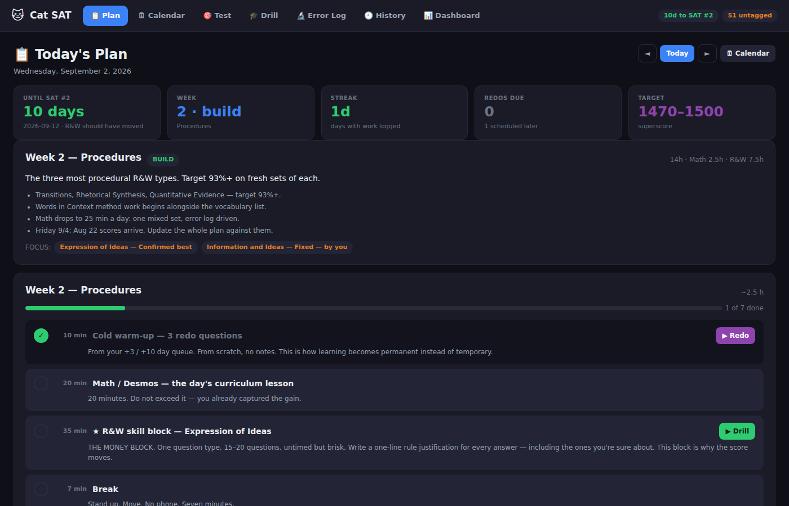
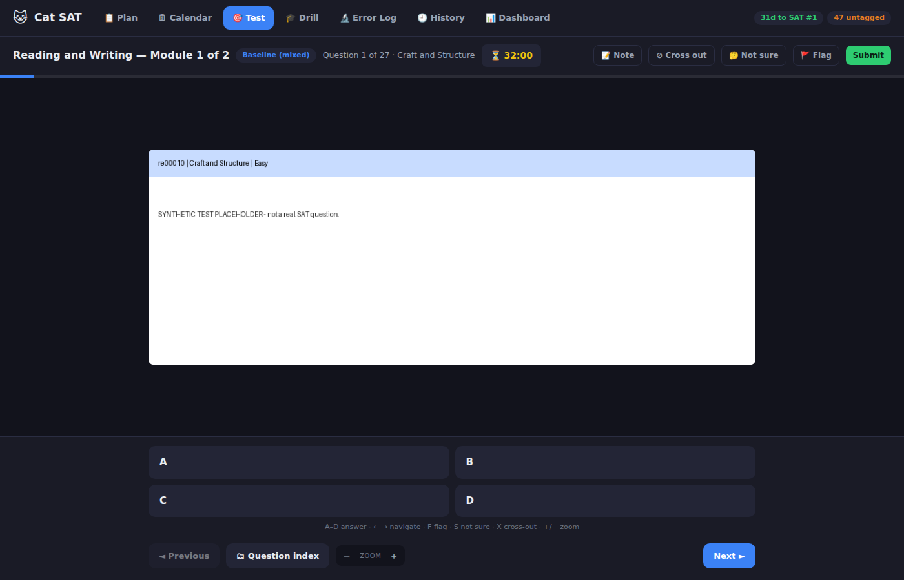
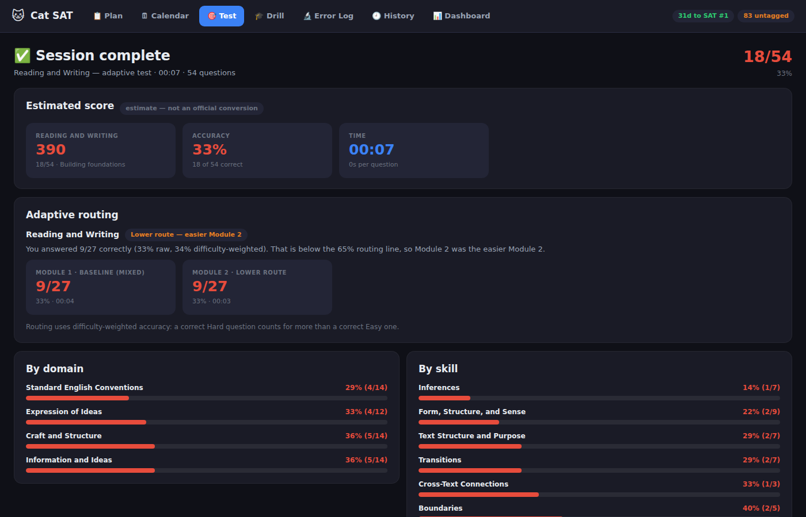
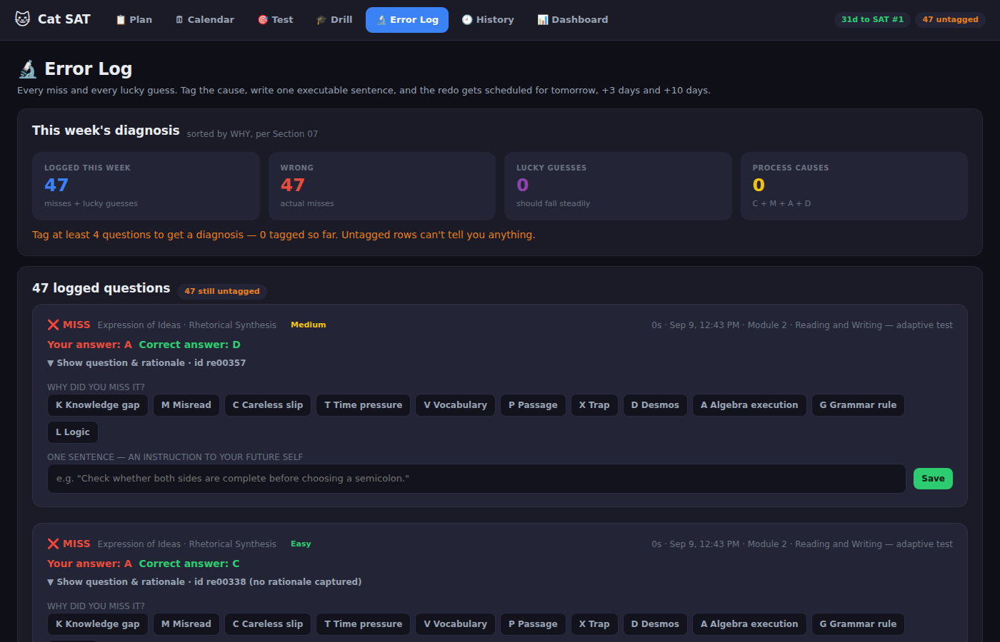
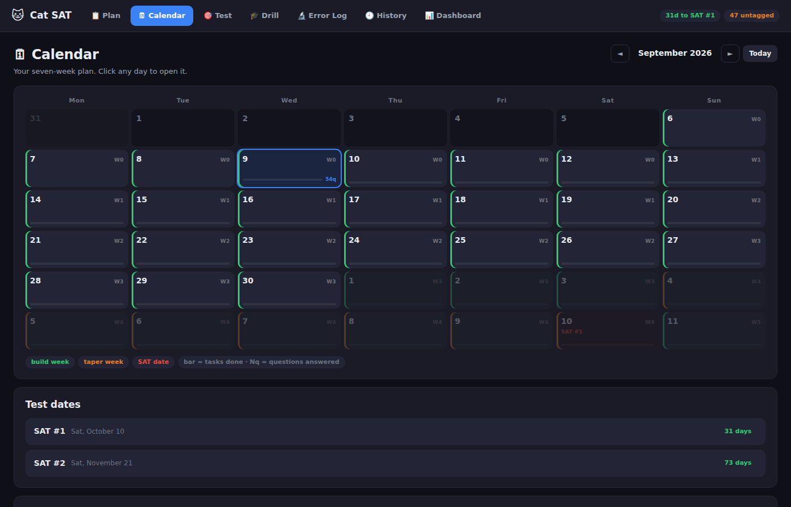
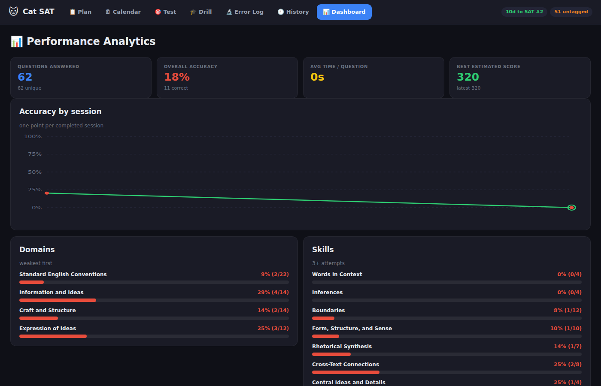
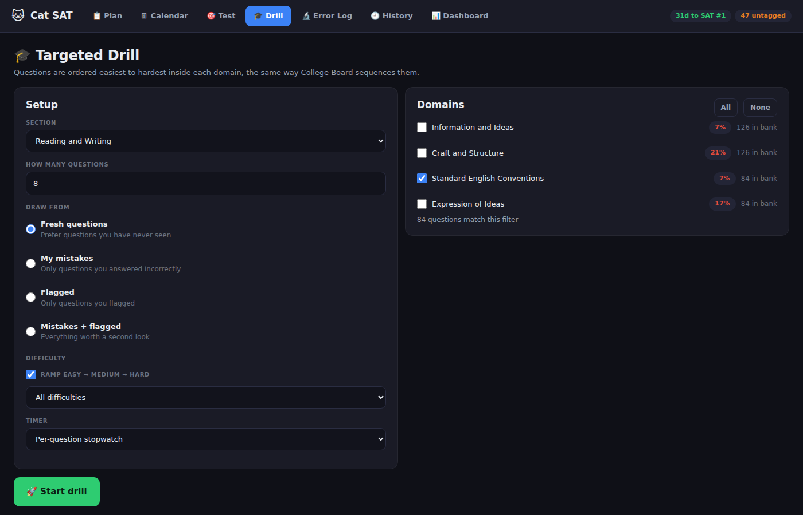

I designed and tested the app; the practice data and the benchmarks are mine.

However, I am open about the AI. Most of the code was written by AI under my direction. What's mine is the design, the product decisions, the debugging, and the judgment about what the tool should measure. This was a personal project that I made for the sole reason that every SAT app that I went out to try was hidden behind a paywall. This motivated me to make one that's open source and public so everyone can use an interactive app that has a question bank and access to everything for free. For me, it's worked so far. I used it for 2 weeks, and my score went from a 1340 to a 1400, and now I have 2 more tries to try to get a 1500, and this is the product that I will be using to study. These are just some thoughts that I wanted to express before you get to the logistics and how it works on the bottom.


# Cat Prep

An adaptive Digital SAT practice engine I built for myself, then kept building because it worked.

> Every SAT app I found was paid, capped how many questions you could see, and gave you a
> percentage at the end instead of telling you *why* you got things wrong. College Board gives
> the questions away for free. What those apps actually sell is the structure around them. So I
> built the structure.

**No question content is included in this repository.** You import your own from the official
Question Bank — see [Getting started](#getting-started).

---

## ⚠️ Read this first

This repo contains **no College Board material** — no questions, no images, no PDFs, no database.
The importer builds all of that locally on your machine from exports you download yourself.

Screenshots in this README are generated from a **synthetic demo bank** (`dev_tests/make_fake_bank.py`),
not from real questions.

SAT® is a registered trademark of the College Board, which was not involved in the production of,
and does not endorse, this software.

**Two things to know before you start:**

- **You need a real score report for targeted planning.** Bluebook *practice* reports draw the
  eight domain bands as pictures, so only the total and section scores can be read out of them.
  The real report from your College Board account has them as text, and those bands are what the
  planner uses. It works without them; it is just less specific.
- **Tested on Windows and Linux.** It should run anywhere Python does, but macOS is untested.



---

## Why I built it

I started at **1340**. My weak area was English, badly. Every tool I tried had the same three
problems: it cost money, it rationed the question bank, and when I got something wrong it told me
I got it wrong and nothing else.

That last one is the real problem. Knowing you missed 9 out of 54 doesn't tell you anything you
can act on. Knowing you missed them because you kept misreading what the question was asking —
that you can fix.

As of the last full practice test I'm at **1400**. The app is a real part of how that happened,
and the part that mattered most wasn't the questions. It was being forced to write down *why*
every single miss happened.

---

## Getting started

You need Python 3.10+ and about ten minutes.

**1. Tell it about you.**

```bash
python setup_profile.py
```

It asks for your score reports, your test dates and your target. Drop in the
PDFs College Board gives you — real sittings from your account, or Bluebook
practice reports — and it reads your total, both section scores, and the
performance band for all eight content domains straight out of the file.

Those eight bands are the whole point. A total score tells you nothing you can
act on. *"Craft and Structure: 550-600, and it's 28% of the section"* tells you
exactly where your next fifty points are.

Everything is written to `database/profile.json` in plain text. Open it, read
it, edit anything that is wrong.

**2. Get the questions.** Go to the official
[SAT Suite Question Bank](https://satsuitequestionbank.collegeboard.org/),
select what you want, and export as PDF. **Export with answers and rationales
included** — the importer needs both. Put them in `Cat Sat/pdfs/`.

**3. Import them.**

```bash
python import_questions.py
```

This cuts each question out of the PDFs, saves it as an image, and writes
everything into a local database. A few minutes for a few thousand questions.
You do it once.

**4. Run it.**

```bash
python run.py
```

Nothing leaves your machine — no account, no network calls, no telemetry.

---

## What the planner decides for you

Three rules do most of the work, and all three came from watching a real plan
succeed and fail:

**A banked section gets zero minutes.** Superscore keeps your best section
forever. Once a section is at the top band across every domain, studying it
cannot raise your score — it can only take time from the section that still
can. The plan will refuse to schedule it.

**A short window before a test goes to a rule-based domain, not your weakest
one.** Transitions and Conventions are closed systems — six logical
relationships, a finite set of punctuation rules — and they move in about a
week. Words in Context and Inference are comprehension, and take three or more.
Spending eight days on a domain that needs three weeks wastes the eight days.
With more than two weeks it takes your weakest domain instead.

**The week before a test is a taper and the day before is off.** Sleep is what
funds attention, and attention is what this test actually measures.

You can see all of it without opening the app:

```bash
python setup_profile.py --show
```

---

## How it works

### The importer — the hardest part of this whole project

`sat_importer.py` is the piece I'm proudest of and the one that took the longest.

The problem: you can't cut a question out of a PDF with fixed margins, because SAT questions are
wildly different sizes. A Standard English Conventions question is three lines. A question about
a graph with a passage is most of a page. Fixed margins get you garbage.

So it cuts on **structure instead of geometry**. The Question Bank export always follows the same
shape — question, then answer, then rationale, then difficulty — so the importer finds those
keywords and the whitespace around them and cuts there. That solved the sizing problem.

Then a second problem showed up: the question ID was getting cut off, so I had no stable way to
refer to a question later. So I added ID extraction and classification.

Then a third: I finished it, ran a full test, went to review my mistakes, and realised I'd only
saved the question — not the explanation. So it now saves **two images per question**: one of just
the question, one of just the answer and rationale.

It's about 400 lines and I had to test it against 40 questions at a time to get the margins and
keywords right. **I have never modified it since it started working, and no other part of this
app is allowed to write to what it produces.**

### Two databases, on purpose

| | `questions.db` | `progress.db` |
|---|---|---|
| Written by | the importer only | the app only |
| Read by | the app, **read-only** | the app |
| Lifetime | rebuild it whenever you want | never rebuilt — it *is* your record |
| Holds | questions, images, answers, difficulty, domain, skill, rationale | every attempt, every note, your error log, your plan progress |

They're separate because they have opposite failure modes. Re-importing the bank should be free
and repeatable. Losing three months of practice history should be impossible. In one file, the
first operation risks the second every time you run it.

### Building a practice test

A module isn't a random sample. The real Digital SAT publishes a blueprint and the app follows it:

| | Reading & Writing | Math |
|---|---|---|
| Per module | 27 questions, 32 min | 22 questions, 35 min |
| | Craft and Structure — 7 | Algebra — 7 |
| Domain quota | Information and Ideas — 7 | Advanced Math — 7 |
| | Standard English Conventions — 7 | Problem-Solving & Data Analysis — 4 |
| | Expression of Ideas — 6 | Geometry and Trigonometry — 4 |

Questions are grouped by domain and ordered easiest to hardest, and in Math the grid-ins come last.

The tricky part is that a module has to satisfy the **domain quota and the difficulty mix at the
same time**, in whole numbers. My first version got this wrong — it produced 9 Craft-and-Structure
questions where the blueprint says 7, which quietly skewed every score it reported. It now uses a
two-margin largest-remainder allocation so the rows hit the domain quota exactly and the columns
hit the difficulty target exactly.

### Adaptive routing

The real test is multistage adaptive: how you do on Module 1 decides which Module 2 you get. So
this does the same.

Routing uses **difficulty-weighted accuracy** rather than raw percentage, because a correct Hard
question is not the same evidence as a correct Easy one:

```
Easy   × 1.00        clear 65% → harder Module 2 (10% easy / 30% med / 60% hard)
Medium × 1.25        below    → easier Module 2 (60% / 30% / 10%)
Hard   × 1.50
```

And the score estimate is **routing-aware**: taking the easier Module 2 caps your section score
around 640, the way the real test does. Getting 100% on the easy route shows you ~640 and an
explanation of why, instead of "100%" and no information.

> These score constants are an approximation. College Board doesn't publish its conversion tables
> and they differ per form. It's monotone, routing-sensitive and bounded — useful for tracking
> progress, not a predicted score, and the app says so everywhere it appears.

### The error log — the part that isn't a quiz app

This is the feature I'd keep if I could only keep one.

Every miss gets classified into one of **eleven causes**:

| | | | |
|---|---|---|---|
| **K** knowledge gap | **M** wrong method | **C** careless slip | **T** time pressure |
| **V** vocabulary | **P** misread the prompt | **X** trap answer | **D** misread data/diagram |
| **A** arithmetic | **G** guessed | **L** lucky (right, but guessed) | |

Two things about that list matter more than the list itself.

**Lucky guesses count as misses.** A right answer you got by eliminating three choices is not
mastery, and counting it as one is exactly how a study log ends up lying to you. The app asks for
your confidence *before* it tells you the answer, so a low-confidence correct answer gets flagged
for review alongside the real errors.

**There's no "other" category.** Free text turns into eleven spellings of "careless" and can't be
added up, and adding it up is the whole point.

Then it makes you write **one sentence** about what you'll do differently — and rejects it if it
isn't executable. "Read more carefully" gets rejected. "Be less careless" gets rejected. Those
restate the error, they don't fix it. Something like *"check both sides are independent clauses
before choosing a semicolon"* gets accepted, because it names a checkable action at a specific
decision point.

Tagging a question schedules it to come back at **+1, +3 and +10 days**. Get it right and it
advances; get it wrong and it resets. Redos are flagged separately so they never inflate your
real accuracy numbers.

Any skill you miss 3+ times in a week becomes a **drill target**, max three at once, and you can't
retire one until you hit 90% on a fresh 15.

### The study plan

A seven-week calendar built backwards from actual test dates, with a month view, build weeks and
taper weeks, and per-day task tracking. Taper weeks genuinely say *do less* — which is the advice
I most needed and least wanted.

---

## Screenshots

All generated from the synthetic demo bank — the interface is real, the questions are not.

**Sitting a module.** Timer, flag, cross-out, not-sure, question index, and a Desmos window on Math questions.



**The review.** Routing decision, why it routed that way, and accuracy broken down by domain and skill.



**The error log.** Eleven causes, and the one-sentence fix it makes you write.



**The calendar.** Seven weeks, build and taper weeks colour-coded, test dates marked, task completion per day.



**Dashboard and drills.**




---

## Why it's a web app now

It started as a CustomTkinter desktop app. It got unusably slow — several hundred milliseconds of
frozen UI on every screen change. I assumed the database had got too big. **It hadn't. Not one of
the six real causes was the database.**

| | What it actually was | Fix |
|---|---|---|
| 1 | Images re-decoded from disk on every state change — 84 decodes per module | LRU cache → 3 |
| 2 | A new database connection per query — 17 per screen switch | Thread-local pooling → 0 |
| 3 | Full screen rebuild on every click — 447 widgets to tick one checkbox | Targeted updates |
| 4 | Unbounded review lists — 930 widgets for a 54-question review | Pagination → ~60 |
| 5 | **TCP delayed-ACK** — every API call cost ~47 ms regardless of payload size | `disable_nagle_algorithm` → 5 ms |
| 6 | **My own loading spinner** — a flat 66 ms, two paint cycles where one would do | Only show it after 180 ms |

After fixing 1–4 it was still slow, and the remaining cost was the toolkit itself: each widget is
three underlying widgets plus rounded corners drawn in Python, so a 447-widget screen is a
half-second freeze *before any of my code runs*. That wasn't fixable by optimising my code, because
it wasn't my code. So I rebuilt the interface as a local web app — and **not one line of the engine
changed**, because the layers were separated well enough that the engine never knew a toolkit
existed.

The two I'm most pleased about are 5 and 6, and I found both the same way: the number was
*suspiciously constant*. A 1 KB response taking exactly as long as a 200 KB one isn't slow code,
it's something waiting on a timer. Same for a flat 66 ms between clicking and seeing anything.

**Measured in real Chromium:** cold load 585 ms · click→painted 28 ms · next question 33 ms ·
build a 54-question review 100 ms · JS heap flat at 10 MB after 36 screen switches · zero JS errors.

---

## Tests

**646 assertions across six suites.** Not "it seems to work."

```bash
python "Cat Sat/dev_tests/test_engine.py"        # 139 — blueprint, routing, scoring, grid-ins
python "Cat Sat/dev_tests/test_ui.py"            # 219 — screen construction, layout regressions
python "Cat Sat/dev_tests/test_full_length.py"   #  53 — a complete two-section sitting, end to end
python "Cat Sat/dev_tests/test_plan.py"          # 142 — all 49 plan days, redo ladder, targets
python "Cat Sat/dev_tests/test_perf.py"          #  94 — cache hits, connection counts, memory
python "Cat Sat/dev_tests/test_web.py"           #  97 — the whole app in real Chromium
python "Cat Sat/dev_tests/test_profile.py"       #  44 — score-report parsing, plan generation
```

Three things I'd point at:

- **Performance budgets are assertions.** `median navigation under 40 ms` fails the run like any
  other test. Performance that isn't asserted regresses.
- **Timings are measured inside the page**, across two animation frames — a remote-controlled click
  costs 60–90 ms on its own, which would swamp a 28 ms measurement.
- **Tests never touch real data.** An early fixture generator wrote hundreds of synthetic images
  into my real image folder and replaced my real question bank. Everything now runs in a sandbox
  directory with a guard that raises if a destructive fixture runs outside it, and the real bank's
  checksum is verified unchanged after every full run. A test suite is a program with side effects
  and needs the same isolation discipline as the thing it's testing.

---

## Layout

```
Cat Sat/
├── adaptive_engine.py    module assembly, routing, scoring, drills
├── diagnostic.py         the 11 causes, prescriptions, redo ladder
├── study_plan.py         the seven-week calendar
├── test_flow.py          session state machine
├── models.py             Question, AttemptRecord, grid-in answer matching
├── question_repo.py      read-only access to the bank
├── attempt_repo.py       every write, and all the analytics queries
├── database.py           schema, repair, connection pooling
├── server.py             stdlib HTTP on 127.0.0.1 — no framework
├── web_api.py            one method per endpoint
├── web/                  app.js · app.css · index.html — no build step
├── score_report.py       reads official CB score report PDFs
├── profile.py            who you are, what you scored, what is banked
├── plan_builder.py       turns a profile into weeks and days
├── sat_importer.py       the importer. Never modified.
└── dev_tests/            646 assertions
```

Built with Python, SQLite, PyMuPDF, Pillow and vanilla JavaScript. **No web framework, no build
step, no runtime dependencies beyond the standard library and Pillow.** It'll still run in five
years.

---

## About AI assistance

I used AI throughout this project and I'm saying so on purpose.

I designed the features and the architecture, decided what the app should do and why, and drove the
debugging. AI helped me implement it and helped me learn faster than I would have alone. The parts
I'm proudest of — the importer's cut-on-structure approach, the eleven-cause taxonomy, the decision
to count lucky guesses as misses — are mine.

The performance investigation above is the honest picture of what that collaboration is actually
like. Four of the six root causes weren't in my application code at all. No model proposed them.
I found them by measuring, and by noticing that a number was constant when it should have varied.
Writing the code is the part that's gotten easy. Knowing the problem isn't where everyone assumes
it is — that part hasn't.

---

## What's next

- Make the study plan generate from any test dates instead of my hardcoded three
- A first-run wizard so a new user isn't dropped straight into the importer
- Progress export and backup
- Responsive layout for phones
- An accessibility pass — keyboard navigation and ARIA roles are incomplete

Feedback and issues genuinely welcome.

---

## Licence

MIT — see [LICENSE](LICENSE). Covers my code only. It does not cover, and cannot grant any rights
to, College Board's question content, which is not distributed here.
